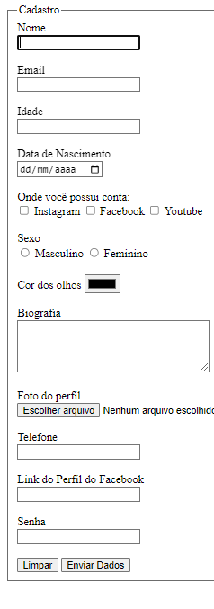

# 1° Formulário HTML

> Projeto criado para realização de inscrição em um site.

### Ajustes e melhorias.

O projeto ainda está em desenvolvimento e as próximas atualizações se concentrarão nas seguintes tarefas:

- [x] Tarefa 1 (Exemplo 1)
- [x] Tarefa 2 (Exemplo 2)
- [ ] Tarefa 3 (Exemplo 3)
- [x] Tarefa 4 (Exemplo 4)
- [ ] Tarefa 5 (Exemplo 5)

 
## 🤝 Colaboradores

Agradecemos às seguintes pessoas que contribuíram para este projeto:

<table>
  <tr>
      <td align="center">
          <a href="#">
                 
                
                <b>Isaque Batista</b>
                
         </a>
      </td>
  </tr>
</table>
